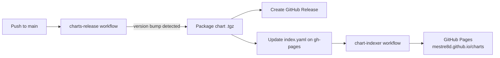

# mestre8d Helm Charts

[](https://opensource.org/license/gpl-3-0/)
[](https://github.com/mestre8d/charts/actions/workflows/charts-release.yaml)
[](https://github.com/mestre8d/charts/actions/workflows/chart-indexer.yaml)
[](https://mestre8d.github.io/charts)

A curated collection of [Helm](https://helm.sh) charts maintained by **mestre8d**, published as a
GitHub Pages Helm repository.

> 📦 **Helm repository URL:** https://mestre8d.github.io/charts

---

## Table of contents

- [Quick start](#quick-start)
- [Configuration](#configuration)
- [Available charts](#available-charts)
- [Repository layout](#repository-layout)
- [Branching model](#branching-model)
- [Release & publishing flow](#release--publishing-flow)
- [Versioning policy](#versioning-policy)
- [Contributing](#contributing)
- [Local development](#local-development)
- [Chart conventions](#chart-conventions)
- [Testing](#testing)
- [Security](#security)
- [Compatibility](#compatibility)
- [Support](#support)
- [Acknowledgements](#acknowledgements)
- [Maintainers](#maintainers)
- [License](#license)

---

## Quick start

Add the repository and refresh your local cache:

```bash
helm repo add mestre8d https://mestre8d.github.io/charts
helm repo update
```

Search, install, upgrade and uninstall:

```bash
# Browse what's available
helm search repo mestre8d

# Install pinning a specific chart version (recommended for reproducibility)
helm install my-release mestre8d/<chart-name> \
  --version <x.y.z> \
  -f my-values.yaml

# Upgrade in place
helm upgrade my-release mestre8d/<chart-name> \
  --version <x.y.z> \
  -f my-values.yaml

# Remove
helm uninstall my-release
```

---

## Configuration

Each chart documents its values in its own `README.md` and ships a fully commented
`values.yaml`. Override values at install/upgrade time:

```bash
# Inline overrides
helm install my-release mestre8d/<chart-name> \
  --set image.tag=latest \
  --set service.type=ClusterIP

# Or via a values file (preferred)
helm install my-release mestre8d/<chart-name> -f my-values.yaml
```

> 🔐 **Do not commit secrets** to `values.yaml`. Use `--set`, environment-scoped
> values files kept out of git, [sealed-secrets](https://github.com/bitnami-labs/sealed-secrets)
> or [external-secrets](https://external-secrets.io/) instead.

---

## Available charts

| Chart            | Description                                       | Status        | Source                                             |
| ---------------- | ------------------------------------------------- | ------------- | -------------------------------------------------- |
| `bigcapital`     | Big Capital — open-source accounting platform     | stable        | [./charts/bigcapital](./charts/bigcapital)         |
| `palworld`       | Palworld dedicated game server                    | stable        | [./charts/palworld](./charts/palworld)             |
| `rathena-helm`   | rAthena MMO emulator server                       | stable        | [./charts/rathena](./charts/rathena)               |
| `fluxcp-helm`    | FluxCP — control panel for rAthena                | beta          | [./charts/rathena-fluxcp](./charts/rathena-fluxcp) |
| `romm-helm`      | RomM — game ROM library manager                   | stable        | [./charts/romm](./charts/romm)                     |
| `voting-app`     | Docker example voting app                         | beta          | [./charts/voting-app](./charts/voting-app)         |
| `mysql`          | Legacy MySQL chart                                | ⚠️ deprecated | [./charts/mysql](./charts/mysql)                   |

Refer to each chart's own README for the full list of values, defaults and examples.

---

## Repository layout

```
.
├── charts/                       # One subdirectory per Helm chart
│   ├── bigcapital/
│   ├── mysql/                    # Deprecated
│   ├── palworld/
│   ├── rathena/
│   ├── rathena-fluxcp/
│   ├── romm/
│   └── voting-app/
├── .github/workflows/
│   ├── charts-release.yaml       # Packages charts and updates gh-pages
│   └── chart-indexer.yaml        # Deploys gh-pages to GitHub Pages
├── LICENSE
└── README.md
```

---

## Branching model

| Branch     | Purpose                                                                                |
| ---------- | -------------------------------------------------------------------------------------- |
| `main`     | Source of truth — chart sources, workflows, documentation. **All PRs target this.**    |
| `gh-pages` | Auto-generated. Hosts `index.yaml` and packaged `*.tgz` artifacts served via Pages.    |

> ⚠️ **Do not commit directly to `gh-pages`.** It is updated automatically by CI; manual
> changes will be overwritten or cause repository drift.

---

## Release & publishing flow

Two GitHub Actions workflows automate packaging and publishing.

### `charts-release` &nbsp;·&nbsp; `main` → `gh-pages`

Runs on every push to `main`. It uses
[`helm/chart-releaser-action`](https://github.com/helm/chart-releaser-action) to:

1. Detect charts whose `version:` in `Chart.yaml` has been bumped.
2. Package them into `*.tgz` archives.
3. Create a GitHub **Release** per chart version.
4. Update `index.yaml` on the `gh-pages` branch (`skip_existing: true` — existing
   versions are never republished).

### `chart-indexer` &nbsp;·&nbsp; `gh-pages` → GitHub Pages

Runs when `charts-release` finishes successfully (or via manual `workflow_dispatch`).
It publishes the contents of `gh-pages` to GitHub Pages, exposing the Helm repository
at https://mestre8d.github.io/charts.



---

## Versioning policy

- Charts follow [Semantic Versioning](https://semver.org/) via the `version:` field in
  `Chart.yaml`.
- `appVersion:` tracks the **upstream application** version and is independent from
  `version:`.
- **Every chart change requires a `version:` bump.** CI uses `skip_existing: true`, so a
  PR that modifies templates without bumping the version will not publish anything.

Recommended bumps:

| Type of change                                  | Bump  |
| ----------------------------------------------- | ----- |
| Backwards-incompatible values/template changes  | major |
| New features, new optional values               | minor |
| Bug fixes, doc-only fixes, image tag updates    | patch |

---

## Contributing

1. Fork the repository and create a feature branch from `main`.
2. Add or modify a chart under `charts/<chart-name>/`.
3. **Bump `version:`** in the chart's `Chart.yaml`.
4. Update the chart's `README.md` and `values.yaml` comments as needed.
5. Validate locally (see [Local development](#local-development)).
6. Open a pull request against `main`. Once merged, CI publishes the new version
   automatically.

For larger changes, please open an issue first to discuss the design.

A `CONTRIBUTING.md` is planned with the full guidelines; in the meantime this section is
authoritative.

---

## Local development

Recommended tooling:

- [Helm](https://helm.sh/docs/intro/install/) ≥ 3.12
- [chart-testing (`ct`)](https://github.com/helm/chart-testing)
- [`kubeconform`](https://github.com/yannh/kubeconform) or [`kubeval`](https://www.kubeval.com/)
- [`helm-docs`](https://github.com/norwoodj/helm-docs) (to regenerate per-chart READMEs)

Common commands:

```bash
# Lint a single chart
helm lint charts/<chart-name>

# Render templates with default values
helm template charts/<chart-name>

# Render with overrides
helm template charts/<chart-name> -f my-values.yaml

# Lint every changed chart against main (chart-testing)
ct lint --target-branch main

# Validate rendered manifests against Kubernetes schemas
helm template charts/<chart-name> | kubeconform -strict -summary
```

CI artifacts are reproducible: `helm package charts/<chart-name>` locally yields the same
`*.tgz` produced by the release workflow.

---

## Chart conventions

- One chart per directory under `charts/`.
- Use the recommended Kubernetes [labels and annotations](https://kubernetes.io/docs/concepts/overview/working-with-objects/common-labels/)
  (`app.kubernetes.io/name`, `app.kubernetes.io/instance`, etc.) — typically through a
  `_helpers.tpl` partial.
- Keep `values.yaml` thoroughly commented; values are documentation.
- Provide a `templates/NOTES.txt` describing post-install usage.
- Where useful, ship a `values.schema.json` for early validation.
- Track upstream releases via `appVersion:`; never overload `version:` for that purpose.

---

## Testing

- `helm test` hooks are encouraged for charts that ship runnable smoke tests
  (`charts/mysql` already includes one).
- Pull requests are linted automatically via the release workflow; a dedicated
  `chart-testing` job can be added per-chart as it stabilises.
- When a Kubernetes-version matrix is in use, supported versions are listed in the
  [Compatibility](#compatibility) table.

---

## Security

- **Reporting vulnerabilities:** please open a private security advisory via
  [GitHub Security Advisories](https://github.com/mestre8d/charts/security/advisories/new)
  rather than a public issue. A `SECURITY.md` will be added with the full policy.
- Never commit secrets, tokens, or passwords to chart values. Prefer
  `sealed-secrets`, `external-secrets`, or runtime injection.
- Released chart archives are attached to GitHub Releases; their checksums can be
  verified against `index.yaml` (`digest:` field).

---

## Compatibility

| Requirement | Minimum   | Notes                                              |
| ----------- | --------- | -------------------------------------------------- |
| Helm        | 3.12+     | Tested on the latest 3.x line.                     |
| Kubernetes  | 1.27+     | Older versions may work but are not validated.     |

Per-chart compatibility (e.g. specific CRDs or controllers) is documented in each
chart's README.

---

## Support

- 🐛 **Bugs / feature requests:** [GitHub Issues](https://github.com/mestre8d/charts/issues)
- 💬 **Questions / ideas:** [GitHub Discussions](https://github.com/mestre8d/charts/discussions)
- 📣 **Security reports:** see [Security](#security)

This is a community-maintained project; responses are best-effort.

---

## Acknowledgements

These charts package and build upon excellent upstream projects. All credit for the
underlying applications belongs to their authors and communities:

- [Bigcapital](https://github.com/bigcapitalhq/bigcapital)
- [Palworld dedicated server (thijsvanloef)](https://github.com/thijsvanloef/palworld-server-docker)
- [rAthena](https://github.com/rathena/rathena)
- [FluxCP](https://github.com/rathena/FluxCP)
- [RomM](https://github.com/rommapp/romm)
- [Docker example voting app](https://github.com/dockersamples/example-voting-app)
- [MySQL](https://www.mysql.com/) and the original community Helm chart it derives from

Each chart's `Chart.yaml` lists its specific upstream `sources:`. Individual charts may
inherit licenses from their upstream projects in addition to this repository's license.

---

## Maintainers

- **Filipe Souza** — [@Filipe-Souza](https://github.com/Filipe-Souza) · filipe.souza@mestre8d.com

---

## License

Distributed under the **GPL-3.0** license. See [`LICENSE`](./LICENSE) for the full text.
